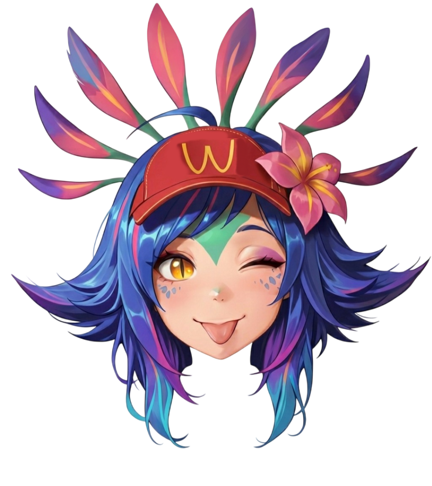

<p align="center">
  <b>🌐 언어:</b>
  <a href="../README.md">English</a> •
  <a href="README_pt-BR.md">Português</a> •
  <a href="README_es.md">Español</a> •
  <a href="README_zh-CN.md">中文</a> •
  <a href="README_ja.md">日本語</a> •
  <a href="README_ko.md">한국어</a>
</p>

<p align="center">
  
</p>

<h1 align="center">🔹 FrostzNeeko Nodes</h1>

<p align="center">
  <b>ComfyUI용 올인원 커스텀 노드 — 대량 생성 워크플로우를 위해 설계</b>
</p>

<p align="center">
  
  
  
</p>

---

## 💬 이것을 만든 이유

저는 **Patreon**, **Pixiv**, **DeviantArt** 등의 플랫폼에 콘텐츠를 올립니다 — 즉, 매일 AI 이미지를 대량 생성합니다. ComfyUI를 처음 사용하기 시작했을 때, 온라인에서 찾은 모든 워크플로우는 악몵이었습니다: 기본 생성과 얼굴 수정만 하는데 **30, 40, 때론 50개 이상의 노드**. 스파게티 배선 투성이, 디버그 불가능, 그리고 커뮤니티에서 아무도 도와주지 않았습니다.

그래서 직접 만들었습니다.

이 노드들은 전체 파이프라인을 하나의 깨끗한 블록으로 압축합니다. 이전에 **~40개 노드**가 필요했던 것이 이제 **~7개**만 필요합니다 — 동일한 품질, 동일한 제어, 제로 스트레스. 먼저 저 자신을 위해 만들었지만, 같은 혼란 속에서 고군분투하는 다른 크리에이터들이 있다는 것을 알고 있습니다. **당신의 몇 시간의 좌절을 절약할 수 있다면, 그것으로 충분합니다.** 아무도 저를 도와주지 않았기에, 저가 당신을 도와주는 사람이 되고 싶습니다.

Patreon 배치 생성, Pixiv 갤러리 구축, 또는 단순히 더 깨끗한 워크플로우를 원하는 분 — 이 노드들은 당신을 위한 것입니다.

---

## ✨ 하이라이트

- 🎨 **시안 네온 테마** — 모든 노드가 커스텀 다크 틸 룩으로 눈에 띉니다
- 📄 **파일에서 프롬프트** — `.txt`에서 프롬프트를 읽고 상태 기반 라인 모드로 처리하며, 와일드카드 해석과 LoRA 인라인 로드를 지원
- ⚡ **Supreme KSampler** — 내장 빈 Latent, 실시간 미리보기, 업스케일러, 디테일러 토글, 전부 다 들어있습니다
- 👁️ **원노드 Face Detailer** — 감지 + 디테일을 하나의 노드에서 처리
- 🔧 **BREAK 및 대괄호 지원** — `BREAK` 키워드와 `[약화]` 대괄호가 모든 곳에서 작동
- 🎛️ **정리된 UI** — 접을 수 있는 위젯 섹션

---

## 🆕 최근 업데이트

- Face Detailer: 마스크 미리보기, tiled VAE encode/decode, refiner 단계, 선택적 `SIGMAS` 입력 추가.
- Image Saver: 생성 정보(날짜/시간, seed, sampler, prompt, LoRA)를 담은 보기 좋은 PNG 메타데이터 추가.
- Image Saver: 해당 포맷 메타데이터를 켜고 끌 수 있는 `save_pretty_metadata` 토글 추가.

---

## 📦 설치

### 방법 1: ComfyUI Manager (권장)
ComfyUI Manager에서 **FrostzNeeko**를 검색하고 설치를 클릭하세요.

### 방법 2: Git Clone
```bash
cd ComfyUI/custom_nodes/
git clone https://github.com/XxFrostzNeekoxX/comfyui-frotszneeko-nodes.git
```

### 방법 3: ZIP 다운로드
다운로드하여 `ComfyUI/custom_nodes/comfyui-frostzneeko-nodes/`에 압축을 풀어주세요.

설치 후 **ComfyUI를 재시작**하세요. 모든 노드가 노드 메뉴의 **FrostzNeeko 🔹** 아래에 표시됩니다.

### 의존성

이 팩은 다른 커스텀 노드 팩에 대한 **필수 의존성이 없습니다**. 모든 것이 독립적입니다.

| 패키지 | 필요? | 용도 |
|---|---|---|
| `ultralytics` | Face Detailer에만 필요 | YOLO 얼굴/신체 감지 모델 |
| `opencv-python` | 선택 사항 | 더 나은 마스크 팽창 (없으면 numpy로 대체) |

Face Detailer를 사용한다면 ultralytics를 설치하세요:
```bash
pip install ultralytics
```

Ultralytics 감지 모델 (`.pt` 파일)도 `ComfyUI/models/ultralytics/bbox/` 또는 `ComfyUI/models/ultralytics/segm/`에 필요합니다. 어떤 YOLO 모델이든 작동합니다.

---

## 🔹 노드

### FN Prompt From File (올인원)

대량 생성 워크플로우의 두뇌. `.txt` 파일에서 프롬프트를 읽고 하나의 노드로 모든 것을 처리합니다.

| 기능 | 설명 |
|---|---|
| **라인 선택** | `increment`, `decrement`, `random`, `random no repetitions`, `fixed` |
| **배치 카운터** | 숨겨진 `count`를 프론트엔드 JS가 자동으로 채우고, 새 큐에서 리셋 |
| **시작 라인** | `line_to_start_from`으로 시작 라인 지정 |
| **와일드카드** | `__tag__` 구문 — `wildcards/` 폴더에서 읽기 |
| **인라인 LoRA** | 프롬프트의 `<lora:이름:가중치>` 태그 — 자동 로드 및 적용 |
| **체크포인트** | 선택적 내장 체크포인트 로더 |
| **CLIP Skip** | 내장 `clip_skip` 매개변수 (기본값 1, 애니메이션 모델은 2로 설정) |
| **BREAK** | 프롬프트를 77토큰 독립 컨디셔닝 청크로 분할 |
| **No-LoRA CLIP** | LoRA 패치 없는 깨끗한 `no_lora_clip` 출력 |

**출력:** `MODEL`, `CLIP`, `no_lora_clip`, `VAE`, `CONDITIONING`, `processed_prompt`, `raw_prompt`, `line_number`

---

### FN Supreme KSampler

메인 작업 노드. 완전한 KSampler, 모든 것이 내장 — 필요한 유일한 샘플러 노드.

**출력:** `LATENT`, `IMAGE`, `detail_pipe`

---

### FN Face Detailer

자동 얼굴 감지 및 인페인팅을 **하나의 노드**에서 처리합니다.

**출력:** `IMAGE`, `mask_preview`

---

### FN CLIP Dual Encode

하나의 노드에 두 개의 텍스트 영역 — 위가 긍정, 아래가 부정.

**출력:** `positive CONDITIONING`, `negative CONDITIONING`, `CLIP`

---

### FN CLIP Text Encode (Advanced) · FN Checkpoint Loader · FN Image Saver

추가 기능이 있는 CLIP 인코더, 깔끔한 체크포인트 로더, 포맷 및 이름 지정을 완전히 제어할 수 있는 이미지 저장 노드 (`save_pretty_metadata` 지원).

---

## 🔌 일반적인 워크플로우

```
FN Prompt From File → FN CLIP Dual Encode → FN Supreme KSampler → FN Face Detailer → FN Image Saver
```

**~12개 노드 → 5개 노드.** 같은 결과, 더 깔끔한 워크플로우.

> 📁 `workflows/` 폴더를 확인하여 ComfyUI에 직접 가져올 수 있는 워크플로우 템플릿을 얻으세요.

---

## 📄 라이선스

MIT — 마음대로 사용하세요.

---

<p align="center">
  
  <br/>
  <sub>❤️를 담아 FrostzNeeko 제작</sub>
</p>
